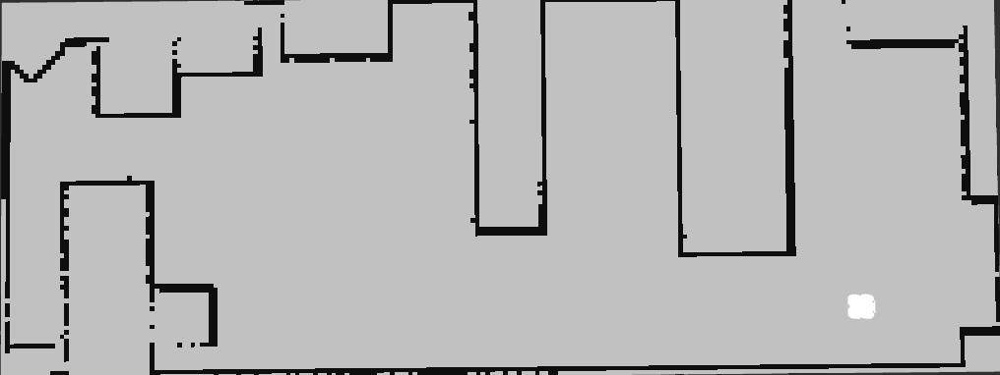
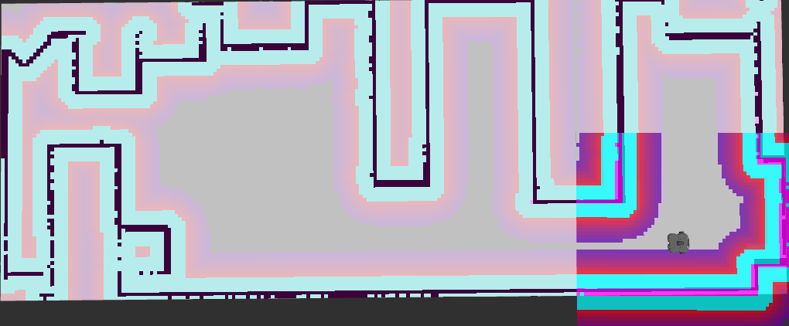

<h1>NAV2 SIMPLE COMMANDER API</h1>

---

**Contents**:

- [Purpose](#purpose)
- [Installation](#installation)
- [Installations for facilitating custom Python scripting](#installations-for-facilitating-custom-python-scripting)
	- [`tf-transformations`](#tf-transformations)
	- [`python3-transforms3d`](#python3-transforms3d)
- [Examples](#examples)
	- [Setting initial pose](#setting-initial-pose)
	- [Setting initial and goal poses](#setting-initial-and-goal-poses)

---

# Purpose
Facilitates the process of (programmatically):

- Creating publishers for certain topics (e.g. `/initialpose`)
- Performing/executing actions (e.g. `navigate_to_pose`)

*Acts as an interface between custom programs and Nav2 stack.*

# Installation
```
sudo apt install ros-<distro>-nav2-simple-commander # Replace <distro> with the name of your ROS 2 distribution
```

As I am using ROS 2 Humble:

```
sudo apt install ros-humble-nav2-simple-commander
```

**NOTE**: *It should have been installed when installing Nav2.*

# Installations for facilitating custom Python scripting
## `tf-transformations`
- Reimplementation of `tf/transformations.py` library
- For common Python spatial operations (e.g. Euler-quaternion conversions)
 
> **Reference**: [`tf_transformations`, **docs.ros.org**](https://docs.ros.org/en/ros2_packages/humble/api/tf_transformations/)

Install using:

```
sudo apt install ros-humble-tf-transformations # For ROS 2 Humble distribution
```

## `python3-transforms3d`
Code to convert between various geometric transformations:

- Composing rotations / zooms / shears / translations into affine matrix
- Decomposing affine matrix into rotations/zooms/shears/translations
- Conversions between different representations of rotations, including:
	- 3x3 Rotation matrices
	- Euler angles
	- Quaternions

> **Reference**: [`transforms3d 0.4.2`, **pypi.org**](https://pypi.org/project/transforms3d/)

**SIDE NOTE**: **"Affinity" is a geometric transformation that preserves lines and parallelism.*

Install using:

```
sudo apt install python3-transforms3d
```

Alternatively, you can do:

```
pip install transforms3d
```

# Examples
For each example, the following processes were run (in separate terminals):

- `ros2 launch turtlebot3_gazebo turtlebot3_design_lab.launch.py` <br> *You can replace this launch file with your preferred\**
- `ros2 launch nav2_bringup bringup_launch.py use_sim_time:=True map:=./maps/design-lab-via-slam.yaml` <br> *You can replace this map path with your preferred\**
- `ros2 run rviz2 rviz2`

\* *See [Gazebo Simulation in Custom Environment](./gazebo-simulation-in-custom-environment_using_turtlebot3.md) for more details.*

## Setting initial pose
- Set the initial pose estimate
- The localiser uses this as a first guess to localise the agent
- Hence, ensure the initial pose estimate is roughly where the agent is

**NOTE**: *We are not setting actual position, only setting estimated position.*

---

**Code**:

See [`set_initial_pose.py`](../../scripts/interact-programmatically-with-nav2/set_initial_pose.py)

*In WSL, the above was saved in `~/ros2_scripts/`.*

**Terminal output**:

```
$ ~/ros2_scripts/./test_for_nav2_simple_commander_api.py
[INFO] [1746379797.875792906] [basic_navigator]: Publishing Initial Pose
[INFO] [1746379801.045427463] [basic_navigator]: Setting initial pose
[INFO] [1746379801.046665229] [basic_navigator]: Publishing Initial Pose
[INFO] [1746379801.047824962] [basic_navigator]: Waiting for amcl_pose to be received
[INFO] [1746379801.048998961] [basic_navigator]: Setting initial pose
[INFO] [1746379801.049927337] [basic_navigator]: Publishing Initial Pose
[INFO] [1746379801.051104503] [basic_navigator]: Waiting for amcl_pose to be received
[INFO] [1746379801.052105695] [basic_navigator]: Setting initial pose
[INFO] [1746379801.053053653] [basic_navigator]: Publishing Initial Pose
[INFO] [1746379801.054135667] [basic_navigator]: Waiting for amcl_pose to be received
[INFO] [1746379808.429081555] [basic_navigator]: Nav2 is ready for use!
```

**Visual output**:

*Before setting initial pose at origin*...



*After setting initial pose at origin*...



## Setting initial and goal poses
- Set initial pose estimate
- Set goal pose

---

**Code**:

See [`set_initial_and_goal_poses.py`](../../scripts/interact-programmatically-with-nav2/set_initial_and_goal_poses.py)

*In WSL, the above was saved in `~/ros2_scripts/`.*

**Visual outputs**:


---

**Key consideration**:

Ensure the initial pose estimate is roughly where the robot is positioned.

*Otherwise, robot may fail to localise and navigation would be erroneous.*
