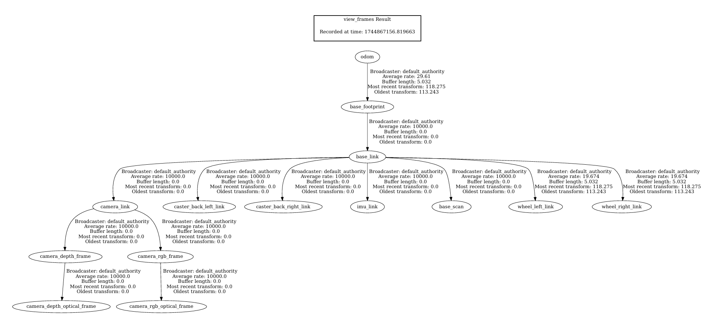

<h1>NAV2 STACK OVERVIEW</h1>

---

**Contents**:

- [Servers](#servers)
  - [Planner server](#planner-server)
  - [Behaviour server](#behaviour-server)
- [Path planning](#path-planning)
  - [Costmap](#costmap)
  - [Global planner](#global-planner)
  - [Controller (local planner)](#controller-local-planner)
  - [Broad process flow](#broad-process-flow)
- [Recovery behaviour](#recovery-behaviour)
- [Transform (TF): _ROS 2 concept applied to Nav2_](#transform-tf-ros-2-concept-applied-to-nav2)
  - [Key coordinate frames for Nav2](#key-coordinate-frames-for-nav2)
    - [`base_scan`](#base_scan)
    - [`base_link`](#base_link)
    - [`base_footprint`](#base_footprint)
    - [`odom`](#odom)
    - [`map`](#map)
  - [Key TFs needed for Nav2](#key-tfs-needed-for-nav2)
    - [TF structure for navigation purposes](#tf-structure-for-navigation-purposes)
  - [Example of TFs used in Nav2](#example-of-tfs-used-in-nav2)
- [Broad architecture](#broad-architecture)
- [Nav2 plugins](#nav2-plugins)

---

# Servers
## Planner server
Implements planning in Nav2.

## Behaviour server
Implements robot behaviours in Nav2, including recovery behaviour.

# Path planning
## Costmap
A numerical grid that associates each grid position with a cost.

**NOTE 1**: _Cost => Difficulty of traversing the grid cell_

**NOTE 2**: _Obstacles must have the highest cost._

**_The costmap acts as the search space for path planning._**

---

**Global costmap**:

- Represents a wider area of the environment
- Helps give a wide-scale view of traversal difficulty
- May be lower resolution for memory efficiency
- Updated less frequently for computational efficiency

**Local costmap**:

- Represents a relatively small localised area around the agent
- Helps give fine-grained view of traversal difficulty
- May be higher resolution for precision
- Updated more frequently to enable dynamic collision avoidance
- Updates on global costmap w.r.t. local optimisations

## Global planner
- Tries to compute the optimal path to the goal <br> _With respect to the global costmap_
- Updates and uses global costmap
- Computationally intensive => Computes less frequently

## Controller (local planner)
- Specifies how the robot must move to follow the global path <br> _With respect to the local costmap_
- May prefer shorter local paths where possible
- Updates and uses local costmap
- Needs rapid updates => Computes more frequently

---

ANALOGY: Global planner = GPS, Controller = Driver

## Broad process flow
```
  (navigation goal)
          |
          v
    GlobalPlanner     .
          |           .
     (global path)    . Planner Server
          |           .
          v           .
      Controller      .
          |
  (velocity commands)
          |
          v
RobotHardwareController
          |
          v
        Motors
```

# Recovery behaviour
Predefined action/action sequences taken upon failure events.

**NOTE**: _Recovery behaviours are mapped to 1+ failure events._

---

Common recovery behaviours:

- Wait
- Spin
- Clear costmap

These behaviours are activated as per [Nav2's behaviour tree](../associated-research/the-marathon-2--a-navigation-system.md#behaviour-tree-bt).

# Transform (TF): _ROS 2 concept applied to Nav2_
See [Transform in ROS 2](./transform-in-ros2.md)

## Key coordinate frames for Nav2
**NOTE**:

- These are not defined in Nav2, only used by Nav2
- All transforms in ROS 2 are defined in `tf2`

---

### `base_scan`
Reference frame of the robot's environment scanner.

### `base_link`
Reference frame of the base of the robot.

### `base_footprint`
Reference frame obtained by projecting `base_link` to the ground

=> Putting z-axis as 0

### `odom`
Reference frame for odometry.

---

**Odometry**:

Estimate change in position over time using motion sensor data.

---

Odometry combines 1+ inputs:

- Wheel encoders
- IMU (Inertial Measurement Unit)

### `map`
Reference frame encapsulating the entire environment map.

## Key TFs needed for Nav2
1. `map --> odom`
2. `odom --> base_link` (via `base_footprint`)
3. `base_link --> base_scan`

### TF structure for navigation purposes
```
  map   odom
   |     |
   +--+--+
      |
      v
base_footprint
```

However, by design `tf2` allows at most 1 parent per TF

=> We must implement the following technical workaround:

```
     map
      |
      v
     odom
      |
      v
base_footprint
```

This is not logically sensible, just a technical workaround.

---

Why have this approach?

- `map` -> Precise location (especially long-term)
- `odom` -> Smooth location sequences in the short term

=>

- `odom` helps determine the short-term local path accurately
- `map` helps correct for errors in `odom` <br> _`odom` errors tend to accumulate over time, e.g. drift_
- Hence, `odom` may jump around due to error corrections
- But `map + odom -> base_footprint` remains stable <br> => Stable robot localisation <br> => Stable visualisation and planning

## Example of TFs used in Nav2


**NOTE**: _Not all TFs would be used/needed in a given use-case._

# Broad architecture


Source: [**docs.nav2.org**](https://docs.nav2.org/)

---

**NOTE**:

- Behaviour tree and TFs are defined independently of Nav2
- Waypoint follower and autonomy system:
    - Obtain data from Nav2 topics
    - Send data for Nav2 nodes to use
    - They act as _extensions to Nav2_
- Velocity smoother, collision monitor and robot base:
    - Obtain data from Nav2 topics
    - Do not send any data; _they implement Nav2 outputs_
- Robot base refers to the robot hardware controller/simulation

# Nav2 plugins
> **Reference**: [_Navigation Plugins_, **docs.nav2.org**](https://docs.nav2.org/plugins/index.html#plugins)

**Plugin interfaces**:

APIs to create custom applications or algorithms using Nav2.

---

_Nav2 has a number of available plugins; we can also create one._

Specifically, Nav2 plugins are of the following kinds:

- Costmap layers
- Costmap filters
- Planners
- Controllers
- Smoothers
- Behaviors
- Behaviour tree nodes
- Progress checkers
- etc.

---

Some notable plugins:

- Binary Filter by Alexey Merzlyakov (costmap filter)
- DWB Controller by David Lu!! (controller)
- SmacPlanner2D by Steve Macenski (planner)
- Simple Smoother by Steve Macenski (smoother)
- Spin by Steve Macenski (behaviour)
- Wait by Steve Macenski (behaviour)
- Clear Costmap by Eitan Marder-Eppstein (behaviour)
- PoseProgressChecker by Guillaume Doisy (progress checker)