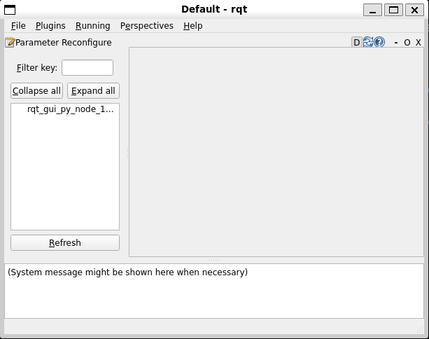

<h1>NAV2 PARAMETER CONFIGURATION</h1>

---

**Contents**:

- [Dynamic configuration using `rqt`](#dynamic-configuration-using-rqt)
- [Static configuration by editing parameter files](#static-configuration-by-editing-parameter-files)

---

# Dynamic configuration using `rqt`
- `rqt` is a ROS-native GUI framework that is able to load various plug-in tools
- This includes Nav2 plugin parameters, including plugins for:
    - Costmaps (local and global)
    - Controller
    - Planner

You can open `rqt` through the CLI by entering `rqt`.

**NOTE**: *Ensure `rqt` is installed; it is usually bundled with ROS 2 installations.*

---

In the `rqt` window, navigate as follows:

- `Plugins` menu in the menu bar
- `Configuration` option within this menu
- `Dynamic Reconfigure` option within this option

This will open the widget to handle dynamic reconfiguration of *running* plugins.

=> To dynamically reconfigure Nav2 parameters, the relevant nodes must be running.

---

**Visual example**:

`rqt` `Parameter Reconfigure` widget before `nav2_bringup` is launched:



`rqt` `Parameter Reconfigure` widget after `nav2_bringup` is launched (1):


`rqt` `Parameter Reconfigure` widget after `nav2_bringup` is launched (2):


# Static configuration by editing parameter files
We can access the parameters of the plugins of a particular package or node by accessing the relevant directory in the local installation of ROS 2. For example, for Nav2, the parameters are stored for the `nav2_bringup` node. The plugin configurations (including local and global costmaps, controller, planner and localiser) are stored in the following path:

```
/opt/ros/humble/share/nav2_bringup/params/nav2_params.yaml
```

**NOTE**: *The above file also contains which plugins to use.*

---

**KEY POINT: Write permissions**:

Ensure you have sufficient write permissions to edit the above file. This can be achieved by using the `sudo` (superuser do) command. For example, to open the above parameter file with superuser privileges, we can run `sudo nano /opt/ros/humble/share/nav2_bringup/params/nav2_params.yaml`.